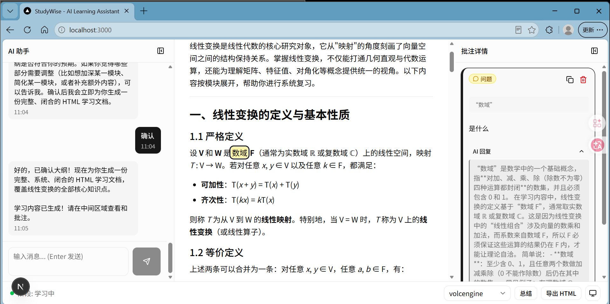
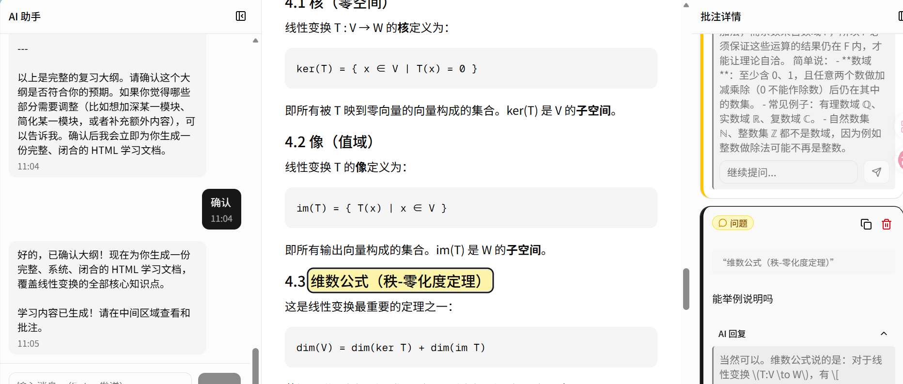
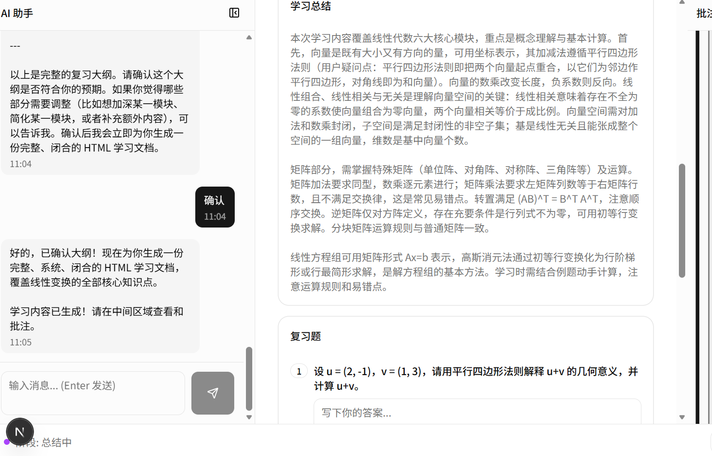

# StudyWise

<p align="center">
  🌐 <a href="README.md">English</a> | <b>简体中文</b>
</p>

> **AI 学习批注助手** — 与 AI 对话生成学习内容，选中文字添加笔记/问题，AI 即时结合上下文解答，学完自动生成总结与复习题，支持导出离线 HTML。

> 🇺🇸 **English version** is available at [README.md](README.md).

<p align="center">
  <a href="https://github.com/free1101/studywise"></a>
  <a href="https://github.com/free1101/studywise"></a>
  <a href="https://github.com/free1101/studywise/actions"></a>
  <a href="./LICENSE"></a>
  <a href="https://img.shields.io/badge/Next.js-16-black?logo=next.js"></a>
  <a href="https://img.shields.io/badge/TypeScript-5-blue?logo=typescript"></a>
  <a href="https://img.shields.io/badge/React-19-61DAFB?logo=react"></a>
  <a href="https://img.shields.io/badge/TailwindCSS-4-06B6D4?logo=tailwindcss"></a>
  <a href="https://img.shields.io/badge/SQLite-3-003B57?logo=sqlite"></a>
  <a href="https://img.shields.io/badge/Drizzle_ORM-0.45-C5F74F?logo=drizzle"></a>
  <a href="https://img.shields.io/badge/Made_with-StudyWise-8A2BE2"></a>
</p>

---

## 📸 界面截图

> **⚠️ 占位** — 运行 `npm run dev` 截图后放入 `docs/screenshots/`，再替换下方图片路径。

| 主学习界面 | 批注与 AI 回复 | 总结与复习题 |
|:---:|:---:|:---:|
|  |  |  |

---

## ✨ 功能特性

- 💬 **AI 对话生成学习内容** — 告诉 AI 你想学什么，自动生成结构化 HTML 学习材料。
- 📝 **选中文字批注** — 在内容上选中任意文字添加笔记或提问；笔记（绿色）与问题（黄色）视觉区分。
- 🤖 **AI 即时回复** — AI 结合上下文对你的问题即时解答。
- 🔗 **双向滚动联动** — 点击高亮，右侧批注栏自动定位（反之亦然）；滚动任意一侧自动同步另一侧。
- 🔎 **多轮追问** — 可在任意 AI 回答处继续追问，问答线程自动折叠保留首条回答。
- 📊 **AI 学习总结** — 学习完成后，AI 基于你的笔记和提问生成知识总结。
- ❓ **复习题** — 自动生成填空/问答形式的复习题，支持交互作答。
- 📤 **导出独立 HTML** — 将内容 + 批注 + 总结 + 复习题导出为单个离线可读的 HTML 文件。
- 🌐 **多 AI 提供商** — 支持火山引擎 DeepSeek / OpenAI 兼容 / Claude，一键切换。
- 💾 **本地优先** — 所有数据存本地 SQLite，API Key 完全由你掌控。

---

## 🚀 快速开始

### 前置要求

- **Node.js 20+**（CI 运行于 Node 24；在 Node 20/24 上开发与测试）
- npm（随 Node 内置）
- 任一 OpenAI 兼容 AI 提供商的 API Key（推荐火山引擎方舟）

### 1. 克隆仓库

```bash
git clone https://github.com/free1101/studywise.git
cd studywise
```

### 2. 安装依赖

```bash
npm install
```

### 3. 配置环境变量

复制 `.env.example` 为 `.env.local`，填入你的 API Key：

```bash
cp .env.example .env.local
```

| 变量 | 说明 | 获取方式 |
|------|------|---------|
| `VOLCENGINE_API_KEY` | 火山引擎方舟 API Key | [火山引擎方舟控制台](https://console.volcengine.com/ark) |
| `VOLCENGINE_ENDPOINT` | API 端点（已预填） | 无需修改 |
| `VOLCENGINE_MODEL` | 模型名（已预填） | 无需修改 |
| `OPENAI_API_KEY` | OpenAI（或任意 OpenAI 兼容端点）API Key | [OpenAI platform](https://platform.openai.com) |
| `OPENAI_BASE_URL` | OpenAI 兼容端点地址（已预填） | 无需修改 |
| `OPENAI_MODEL` | 模型名（已预填） | 无需修改 |
| `CLAUDE_API_KEY` | Anthropic Claude API Key（`ANTHROPIC_API_KEY` 亦可） | [Anthropic console](https://console.anthropic.com) |
| `CLAUDE_BASE_URL` | Anthropic OpenAI 兼容端点（已预填） | 无需修改 |
| `CLAUDE_MODEL` | Claude 模型名（已预填） | 无需修改 |
| `DEFAULT_AI_PROVIDER` | 默认提供商：`volcengine` / `openai` / `claude` | 默认 `volcengine` |

> **三种提供商，一键切换** — 通过 `DEFAULT_AI_PROVIDER` 或在应用内状态栏切换：
> - `volcengine` — 火山引擎方舟（DeepSeek，国内用户推荐）
> - `openai` — OpenAI 官方或**任意 OpenAI 兼容端点**（DeepSeek 官方、通义千问、Kimi、GLM、Ollama 等，将 `OPENAI_BASE_URL` 指向即可）
> - `claude` — Anthropic Claude（走官方 OpenAI 兼容端点）

### 4. 启动开发服务器

```bash
npm run dev
```

打开 [http://localhost:3000](http://localhost:3000) 即可使用。

---

## 🧱 技术栈

| 层级 | 选型 |
|------|------|
| 框架 | Next.js 16 (App Router) |
| 语言 | TypeScript (strict mode) |
| UI | TailwindCSS + shadcn/ui |
| AI | 火山引擎 DeepSeek（OpenAI 兼容格式） |
| 数据库 | SQLite + better-sqlite3 |
| ORM | Drizzle ORM |
| 批注 | @recogito/react-text-annotator |

## 📁 项目结构

```
studywise/
├── app/
│   ├── page.tsx                    # 主学习界面（三栏布局）
│   ├── layout.tsx                  # 全局布局
│   └── api/
│       ├── chat/route.ts           # AI 对话（流式返回）
│       ├── contents/route.ts       # 内容保存
│       ├── annotations/            # 批注 CRUD
│       │   ├── route.ts
│       │   └── [id]/route.ts
│       ├── ai/
│       │   ├── reply/route.ts      # AI 回复批注（多轮追问）
│       │   └── summarize/route.ts  # AI 生成总结 + 复习题
│       ├── summaries/route.ts      # 总结持久化获取
│       └── export/route.ts         # 导出独立 HTML
├── components/
│   ├── ui/                         # shadcn/ui 基础组件
│   ├── chat/                       # 对话面板与消息
│   ├── content/                    # 内容展示 + 批注弹窗
│   ├── annotation/                 # 批注列表与详情
│   ├── summary/                    # 总结 + 复习题
│   ├── export/                     # 导出弹窗
│   └── layout/                     # 侧栏、可拖拽面板、状态栏
├── hooks/
│   ├── useAnnotations.ts           # 批注 CRUD Hook
│   └── useChat.ts                  # AI 对话 Hook
├── lib/
│   ├── db.ts                       # Drizzle + SQLite 连接
│   ├── schema.ts                   # 数据库 Schema 与类型
│   └── ai/
│       ├── providers.ts            # AI 提供商统一接口
│       └── volcengine.ts           # 火山引擎 DeepSeek 封装
├── scripts/                        # 回归测试脚本
├── docs/screenshots/               # 截图存放目录
├── AGENTS.md                       # 开发规范
├── LICENSE
└── package.json
```

---

## 🔧 工作原理

1. **对话 → 内容** — 与 AI 对话；当 AI 产出 HTML 学习材料时，前端提取并渲染到中间内容区。
2. **批注 → 回复** — 选中文字弹出批注输入框，批注存入 SQLite；AI 结合上下文即时回复，追问复用同一接口并携带上一轮回答保持多轮连贯。
3. **滚动联动** — 高亮标记与批注卡片共用稳定 ID；滚动任一侧上报当前可见批注并同步另一侧（带程序滚动抑制，避免循环抖动）。
4. **总结与导出** — 学习完成后，AI 基于笔记/问题生成总结与复习题（持久化到 DB）；导出接口将内容、批注、总结、复习题合并为单个独立 HTML。

---

## 📚 文档

- **[AGENTS.md](AGENTS.md)** — 开发规范、编码标准与自检清单。
- **[question.txt](question.txt)** — 多轮迭代中的 Bug 报告、根因分析与修复记录（质量与严谨性的证明）。
- **[scripts/](scripts/)** — 回归测试：
  - `node scripts/api-test.mjs` — 覆盖所有后端接口的 API 回归测试（需先启动开发服务器）。
  - `node scripts/frontend-logic-test.mjs` — 无依赖的前端纯逻辑契约测试（HTML 提取）。

---

## ❓ FAQ

**如何更换 AI 提供商？**
在 `.env.local` 中将 `DEFAULT_AI_PROVIDER` 设为 `volcengine` / `openai` / `claude`，配置对应的 API Key，并可选在应用内状态栏选择提供商。任何 OpenAI 兼容端点均可通过 `openai` 提供商接入。

**我的数据存在哪里？**
本地 SQLite 数据库文件（项目根目录 `local.db`）。除你发起的 AI API 请求外，数据不会离开你的机器。

**如何部署？**
这是标准 Next.js 应用 —— `npm run build` 后 `npm run start`（或部署到 Vercel）。确保部署环境中 SQLite 文件路径可写，并已配置 API Key。

---

## 🤝 贡献指南

欢迎贡献！请：

1. 先阅读 [AGENTS.md](AGENTS.md) 了解开发规范。
2. Fork 仓库并新建功能分支。
3. 确保 `npm run lint` 与 `npm run build` 通过，并运行 [scripts/](scripts/) 中的回归测试。
4. 提交 Pull Request 并描述改动内容。

---

## ⭐ 支持

如果 StudyWise 对你有帮助，欢迎 **点个 Star ⭐** —— 这能让更多人发现这个项目，也给我们持续迭代的动力！

[](https://github.com/free1101/studywise)

---

## 📄 License

本项目基于 [MIT License](LICENSE) 开源。

---

## ⚠️ 免责声明

- **本地存储** — 所有学习内容、批注、总结均存储在本地 SQLite，我们不会上传你的任何数据到服务器。
- **自带 API Key** — StudyWise 使用**你自己的** API Key 调用 AI 提供商，由此产生的用量与费用由你自行负责。
- 本产品为开源学习演示项目，请自行斟酌使用。
